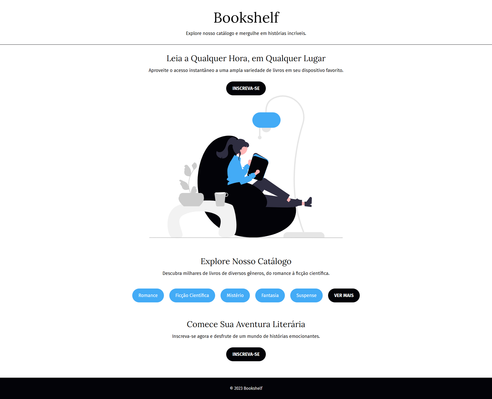

#### PROFESSOR: EVERSON SOUSA | TURMA: 2º EM DESENVOLVIMENTO DE SISTEMAS

DATA DE ENTREGA: 19/FEV
# PROJETO 2 – BOOKSHELF

Recrie a página abaixo utilizando os conhecimentos de CSS aprendidos nas aulas anteriores e pesquisando na documentação W3Schools.

Imagem utilizada no site. Clique com o botão direito, e em Salvar Imagem Como, e jogue a imagem no seu projeto:

Boas práticas! :call_me_hand:
