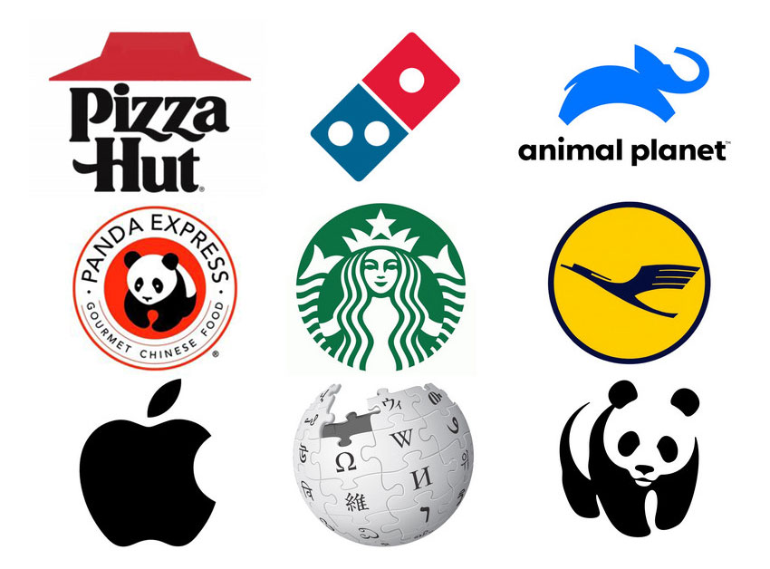

 #### PROFESSOR: EVERSON SOUSA | TURMA: 3º EM DESENVOLVIMENTO DE SISTEMAS

DATA DE ENTREGA: 28/abr | Prazo máximo: 02/mai

# PROJETO 1: CONSTRUINDO A COMUNICAÇÃO VISUAL DO PRODUTO
<!--
## 📜 Introdução (Briefing de Cliente)

Você foi contratado por uma startup de tecnologia para criar **toda a base visual do seu novo produto**.

A empresa quer transmitir **modernidade**, **acessibilidade** e **inovação**.

O produto será uma **plataforma para gerenciar equipes remotas** (tipo um "Trello" para startups pequenas).

O projeto deve conter:

1. Definição de **cores principais e secundárias**.
2. Escolha da **tipografia** (fonte) principal e secundária.
3. Seleção de **elementos visuais** que combinem com a marca (ícones, padrões, gráficos).

---

## 📋 Mão na Massa!

Crie um pequeno portfólio (apresentação) contendo:

### 1. 🎨 Cores

- Defina 2 **cores principais** e 2 **cores secundárias** para o produto.
- Justifique a escolha: o que essas cores transmitem para o público?

**Exemplo Visual:**

| Cor | Código Hexadecimal | Justificativa |
| --- | --- | --- |
| Azul Claro | #4FC3F7 | Passa leveza e modernidade |
| Cinza Escuro | #455A64 | Seriedade e estabilidade |

---

### 2. 🔠 Tipografia

- Escolha 1 **fonte principal** (para títulos) e 1 **fonte secundária** (para textos corridos).
- Explique por que essas fontes combinam com seu produto.

**Exemplo Visual:**

| Fonte | Estilo | Aplicação |
| --- | --- | --- |
| Montserrat | Moderna, limpa | Títulos |
| Roboto | Legível, amigável | Texto normal |

---

### 3. 🖼️ Elementos Visuais

- Escolha ícones ou padrões que irão reforçar a identidade da startup.
- Pode desenhar, usar bancos de imagens gratuitos ou criar no Canva/Figma.

**Exemplo Visual:**

---

## 📢 Entregáveis:

Monte tudo e adicione no seu Github em um README contendo:

✅ Paleta de Cores + justificativa

✅ Tipografia + justificativa

✅ Exemplos de Elementos Visuais

A organização do projeto fica por sua conta, capriche!

Boas práticas! :call_me_hand: