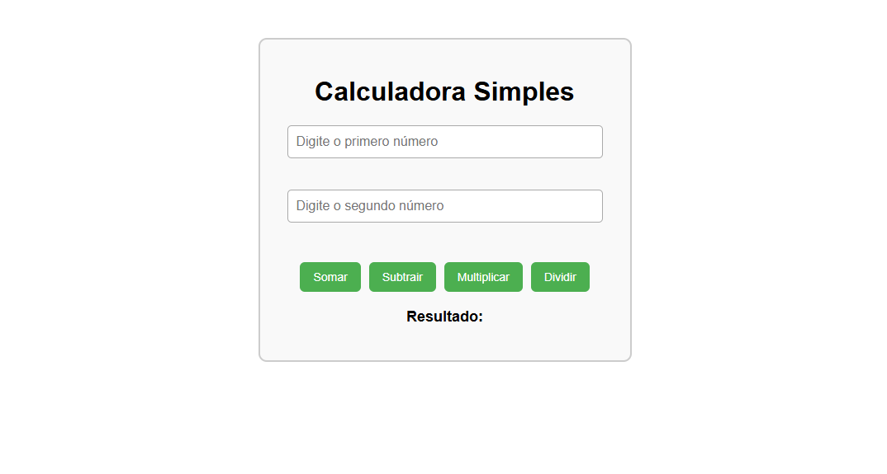

#### PROFESSOR: EVERSON SOUSA | TURMA: 3º EM DESENVOLVIMENTO DE SISTEMAS

DATA DE ENTREGA: 07/MAI | PRAZO MÁXIMO: 13/MAI

*Objetivo: Criar uma interface simples com 2 inputs e botões de operação. Testar se os elementos estão na tela.*

### 💼 **PROJETO 5 - CALCULADORA SIMPLES**

> 🧪 Desafio Interno - Protótipo Visual de Calculadora
> 
> 
> Você foi contratado por uma startup de tecnologia que está validando ideias de microaplicativos para o público jovem. A primeira ideia é uma **calculadora simples**.
> 
> Seu papel, como desenvolvedor júnior da equipe de Front-end, é **criar a interface inicial da calculadora** em React e garantir com testes que **todos os elementos esperados estejam renderizados corretamente na tela**.
> 
> ⚠️ **Importante**: Esse projeto faz parte de um sprint de validação. Ainda não é necessário fazer os botões funcionarem. Isso será feito em uma etapa futura com a equipe sênior.
> 
> Sua missão:
> 
> - Criar um componente chamado `Calculadora.jsx`
> - Adicionar dois inputs numéricos
> - Adicionar quatro botões: **Somar**, **Subtrair**, **Multiplicar**, **Dividir**
> - Adicionar um parágrafo (`<p>`) com o texto inicial: `Resultado:`
> - Criar testes com React Testing Library para garantir que todos os elementos são renderizados

### 🗃️ Estrutura sugerida do projeto:

```
/src
 ├── /components
 │    └── Calculadora.jsx
 └── /__tests__
      └── Calculadora.test.jsx

```

Base do Design UI inicial do projeto:



### ⚠️ VAMOS FAZER UMA MELHORIA NA INSTALAÇÃO DO JEST NO REACT!

Vamos fazer outro tipo de instalação do Jest no React, melhorando e deixando-o mais simples, já que a partir de agora precisará incluir CSS.

### 1. **Crie o projeto com Vite**

Se ainda não tiver o Vite instalado:

```bash
npm create vite@latest nome_do_projeto
```

Depois:

```bash
cd nome_do_projeto
npm install
```

---

### 2. **Instale as dependências de testes**

```bash
npm install --save-dev jest @testing-library/react @testing-library/jest-dom babel-jest
```

```bash
npm install --save-dev jest-environment-jsdom
```

---

### 3. **Configure o Babel**

Crie um arquivo chamado `.babelrc` na raiz do projeto com:

```json
{
  "presets": ["@babel/preset-env", "@babel/preset-react"]
}
```

E instale os presets:

```bash
npm install --save-dev @babel/preset-env @babel/preset-react
```

---

### 4. **Configure o Jest**

Crie um arquivo `jest.config.js` na raiz do projeto:

```jsx
export default {
  testEnvironment: 'jsdom',
  moduleNameMapper: {
    '\\.(css|less)$': 'identity-obj-proxy'
  },
  setupFilesAfterEnv: ['<rootDir>/setupTests.js'],
  transform: {
    '^.+\\.jsx?$': 'babel-jest'
  }
}
```

E instale o `identity-obj-proxy`:

```bash
npm install --save-dev identity-obj-proxy
```

---

### 5. **Crie o setup dos testes**

Arquivo `setupTests.js` na raiz:

```jsx
import '@testing-library/jest-dom'
```

---

### 6. **Crie os arquivos do projeto**

Comece a desenvolver seu projeto em `src/components/Projeto.jsx` .

E depois estilize o projeto em `src/components/Projeto.css` .

No caminho `src/__test__/Projeto.test.js` você desenvolve seu teste.

---

### 7. Não esqueça! **Adicione o script no package.json**

Em `"scripts"` no `package.json`, adicione:

```json
"test": "jest"
```

---

### 8. **Detalhe importante!**

No seus testes, adicione na primeira linha `import React from 'react'` pois ele será necessário para reconhecer alguns detalhes dos seus componentes a partir de agora.

---

### 9.1. **Rode seu projeto**

!!! Lembre-se: para seu projeto aparecer, é necessário refatorar os arquivos `App.jsx` e `main.jsx`.

```bash
npm run dev
```

---

### 9.2. **Rode os testes**

```bash
npm run test
```

### **Por fim, o teste deve sair dessa forma:**
```bash
 PASS  src/assets/__tests__/Calculadora.test.js
  Calculadora Simples
    ✓ renderiza os inputs (27 ms)
    ✓ renderiza os botões (9 ms)
    ✓ exibe o parágrafo de resultado (5 ms)

Test Suites: 1 passed, 1 total
Tests:       3 passed, 3 total
Snapshots:   0 total
Time:        1.077 s, estimated 2 s
```

Se saiu dessa forma, você completou esse projeto. Parabéns!